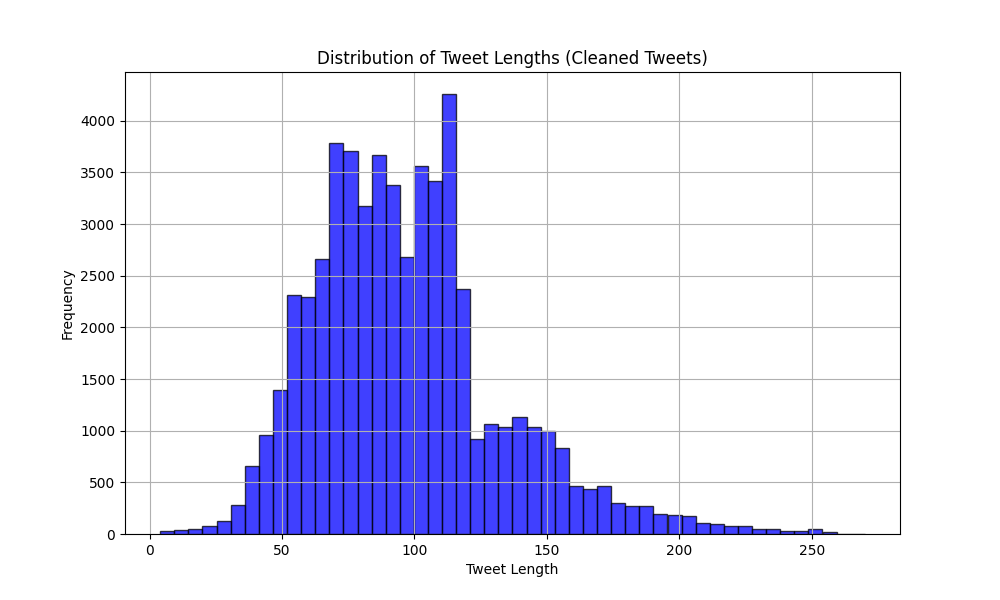
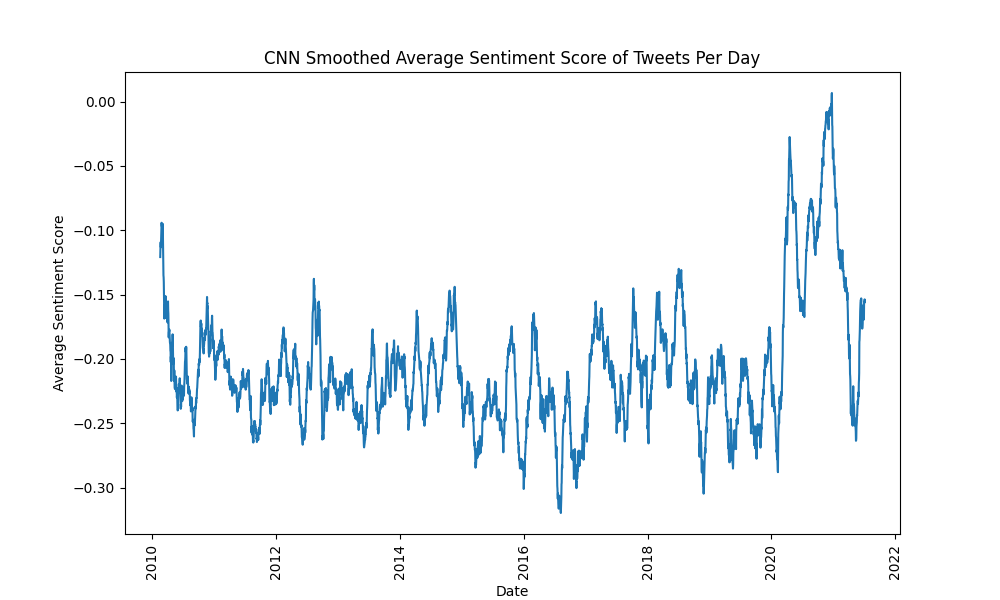
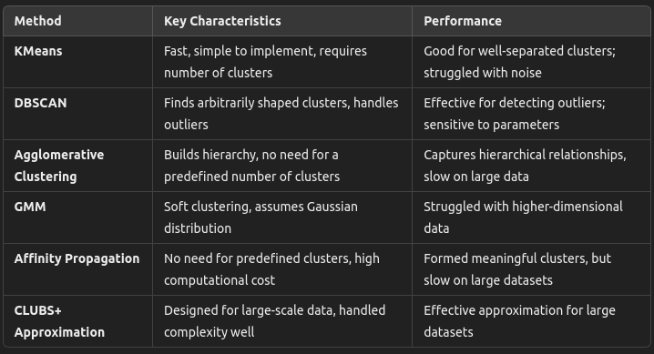

# Big Data Clustering Methods and Sentiment Analysis of Tweets

## 1. Introduction
In this era of big data,clustering methods play a crucial role in organizing and extracting meaningful insights from vast amounts of data. This report explores various clustering methods applied to a dataset of tweets, with a particular focus on identifying the most effective approach for big data clustering applications. Given the diverse nature of clustering techniques and the complexity of big data, our goal is to evaluate and compare different clustering algorithms to determine which method best handles large-scale datasets while delivering meaningful cluster results. The dataset underwent preprocessing and feature extraction using the TF-IDF technique. Multiple clustering methods, including an approximation of the CLUBS+ algorithm designed for large-scale data, were tested. The performance of these methods was assessed to find the most suitable approach for big data clustering tasks.
## 2. Data Preprocessing
The dataset consists of tweets,which were preprocessed to clean and tokenized. 

Preprocessing steps :
**Lowercasing:** All text was converted to lowercase to ensure uniformity.

**Tokenization:** Each tweet was broken into words.

**Sentiment Analysis:** VADER sentiment analysis was performed to compute sentiment scores for each tweet. Sentiment scores were used as an additional feature for some clustering methods.
## 3. Feature Extraction
TF-IDF (Frequency-Inverse Document Frequency):
This method was used to convert textual data into numerical vectors, which serve as inputs to the clustering algorithms. The idea behind TFIDF is to weight the importance of words in a document relative to their appearance in the entire corpus.
## 4. Clustering Methods
Several clustering algorithms were used,each having its unique characteristics:

### 4.1 KMeans Clustering
 KMeans is a partition-based clustering algorithm that divides data into K clusters, where each data point belongs to the cluster with the nearest mean.

**Execution:** Tweets were clustered using the KMeans algorithm, both with and without sentiment scores.
**Strengths:** Simple to implement and computationally efficient.
**Weaknesses:** Assumes spherical clusters and requires specifying the number of clusters in advance.
### 4.2 DBSCAN (Density-Based Spatial Clustering of Applications with Noise)
 DBSCAN is a density-based clustering algorithm that groups points closely packed together, marking points in low-density areas as outliers.

**Execution:** The tweet dataset was clustered based on TF-IDF features.
**Strengths:** Can find arbitrarily shaped clusters and doesn't require the number of clusters to be specified.
**Weaknesses:** Sensitive to parameter settings like eps and min_samples.
### 4.3 Agglomerative (Hierarchical) Clustering
Hierarchical clustering builds a hierarchy of clusters by recursively merging or splitting them.

**Execution:** applied using a bottom-up approach,merging tweets into clusters based on their similarity.
**Strengths:** Doesn't require specifying the number of clusters and can build a full hierarchy of clusters.
**Weaknesses:** Computationally expensive for large datasets and sensitive to noise and outliers.
### 4.4 Gaussian Mixture Models (GMM)
GMM assumes that the data is generated from a mixture of several Gaussian distributions with unknown parameters.

**Execution:** Applied to cluster the tweets based on their TF-IDF features.
**Strengths:** Can model ellipsoidal clusters and soft clustering (points can belong to multiple clusters).
**Weaknesses:** Computationally expensive and may struggle with high-dimensional data.
### 4.5 Affinity Propagation
Affinity Propagation is a message-passing algorithm that clusters data points by exchanging messages between them until convergence.

*Execution:** Tweets were clustered by finding exemplars based on similarity.
**Strengths:** Does not require specifying the number of clusters.
**Weaknesses:** High computational cost and sensitivity to damping factor settings.
### 4.6 CLUBS+Approximation
CLUBS is an algorithm designed for clustering large datasets. Since an exact implementation was unavailable, an approximation using a custom combination of methods (excluding KMeans, DBSCAN, and hierarchical clustering) was applied.

**Execution:** Tweets were clustered using a customized approach involving Affinity Propagation and GMM to approximate CLUBS+ behavior for large-scale clustering.
**Strengths:** Designed for large-scale data and can handle high-dimensional data.
**Weaknesses:** The approximation lacks the exact optimization and distributional scaling features of CLUBS+.
## 5. Sentiment-Based Clustering
One method incorporated sentiment scores from the VADER sentiment analysis into the clustering process. By combining TF-IDF features with sentiment scores, the goal was to observe whether sentiment added value to the clustering process. The clusters were observed to be slightly more coherent when using sentiment scores, particularly in distinguishing between positive and negative sentiments.

## 6. Comparison of Clustering Methods

## 7. Visualization
The clusters formed by each algorithm were visualized using 2D scatter plots (after dimensionality reduction with PCA). This allowed for a visual comparison of the cluster shapes and sizes across different methods.

## 8.Conclusion
In this analysis,we evaluated several clustering methods to determine the most effective approach for handling big data applications, particularly in the context of clustering tweet datasets. Each method was assessed based on its ability to manage large-scale data and deliver meaningful clusters.

KMeans,DBSCAN,Agglomerative Clustering, and various approximations of CLUBS+ were applied.While KMeans is efficient and straightforward, it may struggle with scalability and require tuning of the number of clusters. DBSCAN, although effective for density-based clustering, can be challenging with large datasets due to its computational complexity. Agglomerative Clustering, while providing hierarchical insights, is computationally intensive for large datasets.

For big data applications, where scalability and performance are critical, the CLUBS+ approximation proved to be a promising method. Although CLUBS+ itself is designed for very large datasets, the approximate methods using Gaussian Mixture Models (GMM) and Affinity Propagation offered a good balance between computational efficiency and clustering quality. Among these, GMM demonstrated strong performance in capturing the underlying structure of the data while being computationally feasible for large-scale datasets.

In conclusion, for big data clustering tasks, Gaussian Mixture Models (GMM) emerged as the most suitable method. Its ability to model complex cluster structures and handle large-scale data efficiently makes it an optimal choice for clustering large datasets. The analysis highlights the importance of choosing a clustering method that not only fits the data but also scales effectively with the size of the dataset.